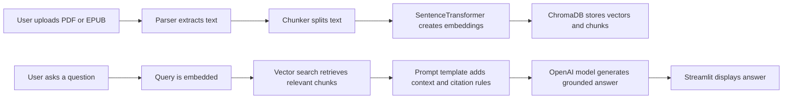

# AI Reading Companion

AI Reading Companion is a Streamlit app that lets you upload a document, ask questions about it, and get AI-generated answers grounded in the document's actual content.

The app supports PDF and EPUB files. After a document is uploaded, it extracts the text, breaks the content into smaller chunks, creates embeddings for those chunks, and stores them in a vector database. When a user asks a question, the app uses retrieval-augmented generation (RAG) to find the most relevant chunks, sends that context to an LLM, and returns an answer with citations to the chunks it used.

In simpler terms: upload a book or document, ask a question in the app, and AI Reading Companion answers based on the uploaded text instead of guessing from general knowledge.

## What It Does

AI Reading Companion turns a static document into an interactive reading experience. Instead of manually searching through a long PDF or EPUB, users can ask questions like:

- What is this document mainly about?
- What happens to a specific character?
- What evidence supports the author's argument?
- Can you summarize this section?
- Where does the document talk about a specific topic?

The response is generated by an LLM, but the answer is grounded in retrieved document chunks. The app also includes chunk citations so users can see which parts of the uploaded document informed the response.

## Why This Project Matters

AI Reading Companion demonstrates the kind of applied machine learning engineering that shows up in real AI products:

- Building a usable app around an LLM, not just a notebook demo
- Parsing messy real-world documents from multiple formats
- Creating embeddings with a local transformer model
- Indexing and querying semantic chunks with a vector database
- Grounding generated answers in retrieved source context
- Designing prompts that require citations and reduce hallucination risk
- Organizing the codebase into clear, reusable modules

For recruiters and hiring managers, this project is meant to show practical AI product instincts: taking an ambiguous problem, choosing the right architecture, and shipping a working prototype with a clean user experience.

## Features

- Upload and analyze `.pdf` or `.epub` documents
- Extract readable text from PDFs and EPUB documents
- Split long documents into overlapping semantic chunks
- Generate embeddings with `BAAI/bge-base-en-v1.5`
- Store and query chunks in an in-memory ChromaDB vector store
- Retrieve the most relevant passages for a question
- Generate answers with OpenAI's Responses API
- Return answers with citations to the retrieved chunks
- Run through a simple Streamlit web interface

## Demo Flow

1. Start the Streamlit app.
2. Upload a PDF or EPUB document.
3. Click **Build Knowledge Base**.
4. The app parses the document text.
5. The text is split into chunks and converted into embeddings.
6. The embeddings and chunks are indexed in ChromaDB.
7. Ask a question in the Streamlit input.
8. The app retrieves the most relevant chunks, passes them to the LLM, and returns an answer with chunk citations.

## Tech Stack

| Area | Tools |
| --- | --- |
| App framework | Streamlit |
| LLM API | OpenAI Responses API |
| Embeddings | Sentence Transformers |
| Embedding model | `BAAI/bge-base-en-v1.5` |
| Vector database | ChromaDB |
| PDF parsing | `pypdf` |
| EPUB parsing | EbookLib, BeautifulSoup |
| Text chunking | LangChain text splitters |
| Configuration | python-dotenv |
| Language | Python |

## Architecture



## Project Structure

```text
ai-reading-companion/
|-- app.py                  # Streamlit UI and end-to-end app orchestration
|-- core/
|   |-- agent.py            # Retrieval and answer generation logic
|   |-- chunker.py          # Text chunking strategy
|   |-- embeddings.py       # Embedding helper using Sentence Transformers
|   |-- parser.py           # PDF and EPUB text extraction
|   `-- vectorstore.py      # ChromaDB index build/search wrapper
|-- prompts/
|   `-- templates.py        # Prompt templates for QA, summaries, and characters
|-- sample_books/           # Local sample/uploaded documents
|-- tests/
|   `-- test_parser.py      # Test scaffold
|-- requirements.txt        # Python dependencies
`-- README.md
```

## How It Works

### 1. Document Parsing

The app accepts PDF and EPUB files. PDFs are processed with `pypdf`, while EPUB files are read with EbookLib and cleaned with BeautifulSoup. The parser normalizes whitespace so later stages receive cleaner text.

### 2. Chunking

Long documents are too large to send directly to an LLM, so the text is split into overlapping chunks with LangChain's `RecursiveCharacterTextSplitter`. The current default is:

- `chunk_size`: 2000 characters
- `chunk_overlap`: 100 characters

This gives the retriever enough context while preserving continuity between neighboring passages.

### 3. Embeddings

Each chunk is embedded using `BAAI/bge-base-en-v1.5`, a strong general-purpose English embedding model from the Sentence Transformers ecosystem. This keeps the semantic search layer local and independent from the LLM API.

### 4. Vector Search

Chunks and embeddings are stored in ChromaDB. When a user asks a question, the app embeds the query, searches for the most similar chunks, and returns the top matches with metadata such as `chunk_num`.

### 5. Answer Generation

The `Agent` builds a context-rich prompt from retrieved chunks and sends it to OpenAI. The prompt explicitly instructs the model to answer only from the provided context and cite chunk IDs.

## Getting Started

### Prerequisites

- Python 3.10 or newer recommended
- An OpenAI API key
- A virtual environment

### Installation

```bash
git clone <your-repo-url>
cd ai-reading-companion
python -m venv venv
source venv/bin/activate
pip install -r requirements.txt
```

### Environment Variables

Create a `.env` file in the project root:

```bash
OPENAI_API_KEY=your_openai_api_key_here
```

### Run the App

```bash
streamlit run app.py
```

Then open the local URL Streamlit provides, usually:

```text
http://localhost:8501
```

## Usage

1. Upload a `.pdf` or `.epub` file.
2. Click **Build Knowledge Base**.
3. Wait for parsing, chunking, embedding, and indexing to finish.
4. Enter a question about the uploaded document.
5. Review the generated answer and chunk citations.

Example questions:

- What is the main argument of this document?
- Who are the most important characters?
- What themes appear most often?
- Summarize the key events in the first half of the document.
- What evidence supports the author's conclusion?

## Key Implementation Details

- The vector database is currently in memory, which makes the app simple to run and easy to reset between uploads.
- The app indexes one document at a time.
- Existing ChromaDB collection contents are cleared before building a new index.
- Retrieval defaults to a larger context window in the agent (`k=15`) to improve answer coverage.
- Prompt templates live separately from application logic, making prompt iteration easier.

## What This Demonstrates

This project highlights experience with:

- RAG application architecture
- LLM orchestration
- Embedding-based semantic search
- Vector database integration
- Prompt engineering for grounded answers
- Python application structure
- Streamlit prototyping
- Document processing pipelines
- Product thinking around user-facing AI tools

## Current Status

This is a functional prototype. It supports the core workflow from upload to citation-backed question answering, with room for production hardening.

The current `tests/` folder is a scaffold for future automated tests. The next best test additions would cover parser behavior, chunking consistency, vector search shape, and agent prompt formatting.

## Roadmap

Potential next improvements:

- Add persistent vector storage for previously uploaded documents
- Support multiple books/documents or a personal reading library
- Add page numbers or chapter-level citations where available
- Add summary, theme, and character analysis modes to the UI
- Stream answers as they generate
- Add richer error handling for malformed PDFs and EPUBs
- Add automated tests for parsing, chunking, and retrieval
- Add evaluation examples for answer quality and citation accuracy
- Deploy the app for easy public demo access

## Design Notes

The app is intentionally compact. The goal is to make the RAG pipeline easy to understand and easy to extend:

- `app.py` handles user interaction and high-level orchestration.
- `core/` contains the reusable AI and document-processing logic.
- `prompts/` keeps model instructions isolated from code.

That separation makes the project easier to maintain, test, and explain in an interview setting.

## Author

Built by Mariah Waslie as a portfolio project exploring practical AI engineering, document intelligence, and user-facing LLM applications.
